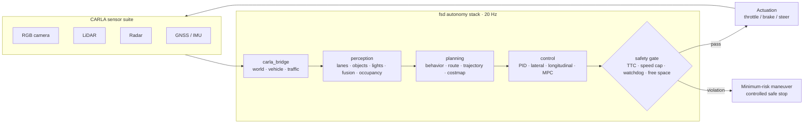

<h1 align="center">Vector FSD</h1>

<p align="center">
  <b>A safety-gated full self-driving research stack for the CARLA simulator.</b>
</p>

> **Status:** active side project, early stage. Parts of this codebase were built
> with AI assistance and are still being cleaned up, so you may see unused code
> or rough edges while the architecture settles. Everything is exercised against
> the pipeline before it lands.

---

## Acknowledgements

Built on tools and publications that deserve explicit credit:

- **[CARLA](https://carla.org/)**: the open-source autonomous-driving simulator this stack runs in.
- **[NVIDIA DRIVE](https://developer.nvidia.com/drive)**: architectural inspiration for the safety-gated design.
- **[NumPy](https://numpy.org/)**: the math under perception, planning, and control.
- **[PyYAML](https://pyyaml.org/)**: configuration.
- The open-source autonomy community (openpilot, Autoware) for design reference.

---

## Overview

`fsd` is a modular end-to-end autonomy stack that drives an ego vehicle inside
CARLA. It follows the classic **Sense → Plan → Act** split with one deliberate
change: **every actuator command is checked by a safety monitor before it reaches
the vehicle**. Perception can be wrong, planning can stall, control can
saturate. The safety gate is the last line of defense and can always force a
minimum-risk stop.

## Architecture



## Getting started

**Prerequisites:** Python 3.11, a CARLA 0.9.15+ server (Windows or Linux).

```bash
# 1: Python dependencies
pip install -r requirements.txt

# 2: get CARLA 0.9.15
powershell -ExecutionPolicy Bypass -File scripts/setup_carla.ps1   # Windows helper
# or download a release: https://github.com/carla-simulator/carla/releases

# 3: start the simulator (separate terminal)
%CARLA_ROOT%\CarlaUE4.exe        # Windows
$CARLA_ROOT/CarlaUE4.sh          # Linux

# 4: run the autopilot
python -m fsd.agents.autopilot --config configs/default.yaml

# no simulator? synthetic smoke mode runs the full pipeline anyway:
python -m fsd.agents.autopilot --no-carla --ticks 300
```

### Configuration

| File | Purpose |
| --- | --- |
| `configs/default.yaml` | Urban driving in `Town10HD_Opt`, 60 km/h safety cap |
| `configs/highway.yaml` | Highway profile, higher speed cap and longer horizon |
| `configs/sensors.yaml` | Sensor mounts and parameters (camera, lidar, radar, GNSS, IMU) |

## Module map

| Module | Path | Responsibility |
| --- | --- | --- |
| `core` | `fsd/core/` | Shared data contracts, YAML config, structured logging |
| `carla_bridge` | `fsd/carla_bridge/` | World lifecycle, ego vehicle, sensor suite, traffic manager |
| `perception` | `fsd/perception/` | Lane detection, object detection, traffic lights, fusion, occupancy, segmentation |
| `planning` | `fsd/planning/` | Behavior FSM, route planner, trajectory generation, costmap |
| `control` | `fsd/control/` | PID, Stanley lateral, speed-tracking longitudinal, MPC-lite |
| `safety` | `fsd/safety/` | Rule-engine monitor, watchdog, diagnostics, minimum-risk fallback |
| `agents` | `fsd/agents/` | Autopilot main loop (entry point), manual override |
| `ml` | `fsd/ml/` | Model registry, inference engine, imitation-learning trainer, recorder |

## Safety model

Safety is a **gate, not a feature**. A `ControlCommand` never reaches the vehicle
directly. `fsd.safety.monitor` evaluates every demand against the configured
envelope on each tick:

- **Time-to-collision**: TTC below `min_ttc_s` forces intervention
- **Speed cap**: demands above `max_speed_mps` are cut
- **Acceleration limits**: anything beyond `max_accel_mps2` / `max_brake_mps2` is clamped
- **Free space**: `free_space_ahead` below `min_free_space_m` blocks forward motion
- **Watchdog**: pipeline data older than `watchdog_timeout_s` is treated as a stall

Violations move the drive mode `ENGAGED → DEGRADED → SAFE_STOP`. `SAFE_STOP` is
terminal for the run: throttle cut, brakes at maximum, vehicle holds until a
human resets it. The full safety case lives in [docs/SAFETY.md](docs/SAFETY.md),
pipeline internals in [docs/ARCHITECTURE.md](docs/ARCHITECTURE.md), and the
performance/C++ migration plan in [docs/PERFORMANCE.md](docs/PERFORMANCE.md).

## Testing

```bash
python -m compileall fsd           # every module compiles clean
python -m unittest discover tests  # contract, safety, and planning suites
```

CI runs both on every push ([.github/workflows/ci.yml](.github/workflows/ci.yml)).

## Roadmap

- [x] Core contracts, config, logging
- [x] Safety-gated control pipeline
- [x] CARLA bridge and synthetic smoke mode
- [ ] C++ hot-path port: safety monitor and control loop (see docs/PERFORMANCE.md)
- [ ] TensorRT-backed perception inference
- [ ] Scenario and fault-injection harness with regression metrics
- [ ] Closed-loop evaluation dashboards (routes completed, disengagements, rule hits)

## Disclaimer

> **Research and simulation only.** This is an educational autonomy stack for
> the CARLA simulator. It has not been validated for any physical vehicle and
> **must never be used on public roads or with physical actuators**. All safety
> mechanisms are best-effort simulation constructs, not certified automotive
> functions.

---

<p align="center"><samp>built by redduxz · MIT license</samp></p>
