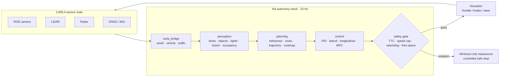

<h1 align="center">Vector FSD</h1>

<p align="center">
  <b>A safety-gated, full self-driving research stack paired with the CARLA simulator.</b>
</p>

> **Status:** an active side project in early development. Portions of this
> codebase were produced with AI assistance and remain under review — one may
> encounter unused code or rough edges whilst the architecture settles. All
> contributions are exercised against the pipeline before landing.

---

## Acknowledgements

This work stands upon tools and publications that deserve explicit credit:

- **[CARLA](https://carla.org/)** — the open-source autonomous-driving simulator in which the stack operates.
- **[NVIDIA DRIVE](https://developer.nvidia.com/drive)** — architectural inspiration for the safety-gated pipeline design.
- **[NumPy](https://numpy.org/)** — the numerical foundation beneath perception, planning, and control.
- **[PyYAML](https://pyyaml.org/)** — configuration management.
- The wider open-source autonomy community — openpilot and Autoware chiefly — for design reference.

---

## Overview

`fsd` is a modular, end-to-end autonomy stack driving an ego vehicle within CARLA.
It follows the classical **Sense → Plan → Act** decomposition with one deliberate
modification: **every actuator command is vetted by a safety monitor before
reaching the vehicle**. Perception may err, planning may stall, and control may
saturate — the safety gate remains the final line of defence and may always
command a minimum-risk stop.

## Architecture



## Getting started

**Prerequisites:** Python 3.11; a CARLA 0.9.15+ server (Windows or Linux).

```bash
# 1 — Python dependencies
pip install -r requirements.txt

# 2 — obtain CARLA 0.9.15
powershell -ExecutionPolicy Bypass -File scripts/setup_carla.ps1   # Windows helper
# alternatively: https://github.com/carla-simulator/carla/releases

# 3 — launch the simulator (in a separate terminal)
%CARLA_ROOT%\CarlaUE4.exe        # Windows
$CARLA_ROOT/CarlaUE4.sh          # Linux

# 4 — run the autopilot
python -m fsd.agents.autopilot --config configs/default.yaml

# without a simulator, a synthetic smoke mode exercises the full pipeline:
python -m fsd.agents.autopilot --no-carla --ticks 300
```

### Configuration

| File | Purpose |
| --- | --- |
| `configs/default.yaml` | Urban driving in `Town10HD_Opt`; 60 km/h safety cap |
| `configs/highway.yaml` | Highway profile; higher speed cap and longer horizon |
| `configs/sensors.yaml` | Sensor mounts and parameters (camera, lidar, radar, GNSS, IMU) |

## Module map

| Module | Path | Responsibility |
| --- | --- | --- |
| `core` | `fsd/core/` | Shared data contracts, YAML configuration, structured logging |
| `carla_bridge` | `fsd/carla_bridge/` | World lifecycle, ego vehicle, sensor suite, traffic manager |
| `perception` | `fsd/perception/` | Lane detection, object detection, traffic lights, fusion, occupancy, segmentation |
| `planning` | `fsd/planning/` | Behavioural FSM, route planner, trajectory generation, costmap |
| `control` | `fsd/control/` | PID, Stanley lateral, speed-tracking longitudinal, MPC-lite |
| `safety` | `fsd/safety/` | Rule-engine monitor, watchdog, diagnostics, minimum-risk fallback |
| `agents` | `fsd/agents/` | Autopilot main loop (entry point), manual override |
| `ml` | `fsd/ml/` | Model registry, inference engine, imitation-learning trainer, recorder |

## Safety model

Safety is treated as a **gate rather than a feature**. A `ControlCommand` never
reaches the vehicle directly; `fsd.safety.monitor` evaluates every demand against
the configured envelope on each tick:

- **Time-to-collision** — a TTC below `min_ttc_s` compels intervention
- **Speed cap** — demands exceeding `max_speed_mps` are curtailed
- **Acceleration limits** — anything beyond `max_accel_mps2` / `max_brake_mps2` is clamped
- **Free space** — `free_space_ahead` beneath `min_free_space_m` prohibits forward motion
- **Watchdog** — pipeline data older than `watchdog_timeout_s` constitutes a stall

Violations progress the drive mode `ENGAGED → DEGRADED → SAFE_STOP`. `SAFE_STOP`
is terminal for the run: throttle is cut, brakes ramp to maximum, and the vehicle
holds position pending human reset. The full safety case is documented in
[docs/SAFETY.md](docs/SAFETY.md); pipeline internals in
[docs/ARCHITECTURE.md](docs/ARCHITECTURE.md); the performance and C++ migration
programme in [docs/PERFORMANCE.md](docs/PERFORMANCE.md).

## Testing

```bash
python -m compileall fsd           # every module compiles cleanly
python -m unittest discover tests  # 36 tests: contracts, safety rules, planning
```

Continuous integration executes both on every push
([.github/workflows/ci.yml](.github/workflows/ci.yml)).

## Roadmap

- [x] Core contracts, configuration, logging
- [x] Safety-gated control pipeline
- [x] CARLA bridge and synthetic smoke mode
- [ ] C++ hot-path port for safety monitor and control loop (see docs/PERFORMANCE.md)
- [ ] TensorRT-backed perception inference
- [ ] Scenario and fault-injection harness with regression metrics
- [ ] Closed-loop evaluation dashboards (routes completed, disengagements, rule hits)

## Disclaimer

> **Research and simulation only.** This project is an educational autonomy
> stack for the CARLA simulator. It has not been validated for any physical
> vehicle and **must never be employed on public roads or with physical
> actuators**. All safety mechanisms are best-effort simulation constructs, not
> certified automotive functions.

---

<p align="center"><samp>built by redduxz · distributed under the MIT licence</samp></p>
