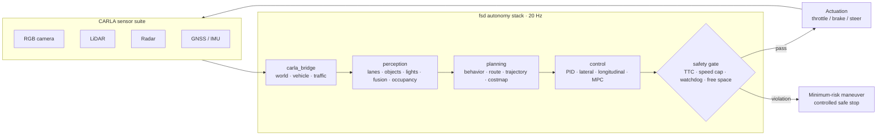

<h1 align="center">NVIDIA-fsd</h1>

<p align="center">
  <b>A CARLA-paired full self-driving research stack — perception, planning, control, and a hard safety gate.</b>
</p>

<p align="center">
  <a href=".github/workflows/ci.yml"></a>
  <a href="LICENSE"></a>
  <a href="https://www.python.org/downloads/"></a>
  <a href="https://carla.org/"></a>
</p>

> **Status:** active side project, early stage. Parts of this codebase were built
> with AI assistance and are still being cleaned up — you may see unused code or
> rough edges while the architecture settles. Everything is tested against the
> pipeline before it lands.

---

## Credits & stack

Built in the open on top of tools that deserve the credit:

- **[CARLA](https://carla.org/)** — the open-source autonomous-driving simulator this stack drives in
- **[NVIDIA DRIVE](https://developer.nvidia.com/drive)** — architectural inspiration for the safety-gated pipeline design
- **[NumPy](https://numpy.org/)** — all the math under perception, planning, and control
- **[PyYAML](https://pyyaml.org/)** — configuration
- **[shields.io](https://shields.io/)** / **[Mermaid](https://mermaid.js.org/)** — badges and diagrams in this README
- Members of the open-source autonomy ecosystem (openpilot, Autoware) for design reference

---

## What it is

`fsd` is a modular end-to-end autonomy stack that drives an ego vehicle inside the
[CARLA](https://carla.org/) simulator. It follows the classical **Sense → Plan → Act**
decomposition with one deliberate twist: **every actuator command passes through a
safety monitor** before it reaches the vehicle. Perception can be wrong, planning
can stall, control can saturate — the safety gate is the last line of defense and
can always force a minimum-risk safe stop.

## Architecture overview



## Quickstart

**Prerequisites:** Python 3.11 · CARLA 0.9.15+ server (Windows or Linux)

```bash
# 1 — Python deps
pip install -r requirements.txt

# 2 — get CARLA 0.9.15
powershell -ExecutionPolicy Bypass -File scripts/setup_carla.ps1   # Windows helper
# or grab a release: https://github.com/carla-simulator/carla/releases

# 3 — start the simulator (separate terminal)
%CARLA_ROOT%\CarlaUE4.exe        # Windows
$CARLA_ROOT/CarlaUE4.sh          # Linux

# 4 — run the autopilot
python -m fsd.agents.autopilot --config configs/default.yaml

# no simulator? synthetic smoke mode runs the full pipeline anyway:
python -m fsd.agents.autopilot --no-carla --ticks 300
```

### Configs

| File | Purpose |
| --- | --- |
| `configs/default.yaml` | Urban driving in `Town10HD_Opt`, 60 km/h safety cap |
| `configs/highway.yaml` | Highway profile — higher speed cap, longer horizon |
| `configs/sensors.yaml` | Sensor mounts + parameters (camera, lidar, radar, GNSS, IMU) |

## Module map

| Module | Path | Responsibility |
| --- | --- | --- |
| `core` | `fsd/core/` | Shared data contracts, YAML config loader, structured logging |
| `carla_bridge` | `fsd/carla_bridge/` | World lifecycle, ego vehicle, sensor suite, traffic manager |
| `perception` | `fsd/perception/` | Lane detection, object detection, traffic lights, fusion, occupancy grid, segmentation |
| `planning` | `fsd/planning/` | Behavior FSM, route planner, trajectory generation, costmap |
| `control` | `fsd/control/` | PID · Stanley lateral · speed-tracking longitudinal · MPC-lite |
| `safety` | `fsd/safety/` | Rule-engine monitor, watchdog, diagnostics, minimum-risk fallback |
| `agents` | `fsd/agents/` | Autopilot main loop (entry point), manual override |
| `ml` | `fsd/ml/` | Model registry, inference engine, imitation-learning trainer, run recorder |

## Safety model

Safety here is a **gate, not a feature**. A `ControlCommand` never reaches the
vehicle directly — `fsd.safety.monitor` evaluates it against the configured
envelope on every tick:

- **Time-to-collision** — TTC below `min_ttc_s` forces intervention
- **Speed cap** — demands above `max_speed_mps` are cut
- **Accel/brake limits** — exceeding `max_accel_mps2` / `max_brake_mps2` is clamped
- **Free space** — `free_space_ahead` below `min_free_space_m` blocks forward motion
- **Watchdog** — pipeline data older than `watchdog_timeout_s` is treated as a stall

Violations move the drive mode `ENGAGED → DEGRADED → SAFE_STOP`. `SAFE_STOP` is
terminal for the run: throttle cut, brakes ramp to max, vehicle holds until a
human resets. Full detail in [docs/SAFETY.md](docs/SAFETY.md); pipeline internals
in [docs/ARCHITECTURE.md](docs/ARCHITECTURE.md).

## Testing

```bash
python -m compileall fsd          # every module compiles clean
python -m unittest discover tests # 36 tests: types, safety rules, planning
```

CI runs both on every push ([.github/workflows/ci.yml](.github/workflows/ci.yml)).

## Roadmap

- [x] Core contracts, config, logging
- [x] Safety-gated control pipeline
- [x] CARLA bridge + synthetic smoke mode
- [ ] Full perception suite on camera/lidar (fusion + occupancy + segmentation hardening)
- [ ] Learned components in `fsd.ml` (onnxruntime inference, recorded training data)
- [ ] Scenario + fault-injection harness, regression metrics
- [ ] Closed-loop eval dashboards (routes completed, disengagements, rule hits)

## Disclaimer

> **Research / simulation only.** This project is an educational autonomy stack
> for the CARLA simulator. It has not been validated for any real vehicle and
> **must never be used on public roads or with physical actuators.** All safety
> mechanisms are best-effort sim constructs, not certified automotive functions.

---

<p align="center"><samp>built by redduxz · contributions welcome when it's stable</samp></p>
