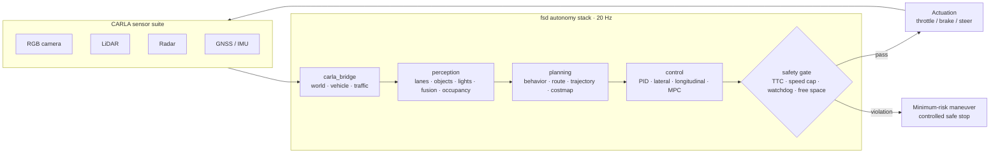

<h1 align="center">NVIDIA-fsd</h1>

<p align="center">
  <b>A CARLA-paired full self-driving research stack — perception, planning, control, and a hard safety gate.</b>
</p>

<p align="center">
  <a href=".github/workflows/ci.yml"></a>
  <a href="LICENSE"></a>
  <a href="https://www.python.org/downloads/"></a>
  <a href="https://carla.org/"></a>
</p>

---

`fsd` is a modular end-to-end autonomy stack that drives an ego vehicle inside the
[CARLA](https://carla.org/) simulator. It follows the classical Sense → Plan → Act
decomposition with one deliberate twist: **every actuator command passes through a
safety monitor** before it reaches the vehicle. Perception can be wrong, planning
can stall, control can saturate — the safety gate is the last line of defense and
can always force a minimum-risk safe stop.

## Architecture overview



## Quickstart

**Prerequisites:** Python 3.11, CARLA 0.9.15+ server (Windows or Linux).

```bash
# 1. Install Python dependencies
pip install -r requirements.txt

# 2. Get CARLA 0.9.15 (Windows helper script)
powershell -ExecutionPolicy Bypass -File scripts/setup_carla.ps1
#    ...or download manually: https://github.com/carla-simulator/carla/releases

# 3. Start the simulator (separate terminal)
%CARLA_ROOT%\CarlaUE4.exe        # Windows
$CARLA_ROOT/CarlaUE4.sh          # Linux

# 4. Run the autopilot against the running server
python -m fsd.agents.autopilot --config configs/default.yaml

#    ...or use the launcher, which waits for the server then starts autopilot
python scripts/run_sim.py --config configs/default.yaml
```

Useful configs:

| Config | Purpose |
| --- | --- |
| `configs/default.yaml` | Urban driving in `Town10HD_Opt`, 60 km/h safety cap |
| `configs/highway.yaml` | Highway profile — higher speed cap, longer horizon |
| `configs/sensors.yaml` | Sensor suite: mount transforms + sensor parameters |

## Modules

| Module | Path | Responsibility |
| --- | --- | --- |
| `core` | `fsd/core/` | Shared data contracts (`types.py`), YAML config loader, structured logging |
| `carla_bridge` | `fsd/carla_bridge/` | World lifecycle, ego vehicle spawn, sensor suite, traffic manager |
| `perception` | `fsd/perception/` | Lane detection, object detection, traffic-light state, sensor fusion, occupancy grid, segmentation |
| `planning` | `fsd/planning/` | Behavior decisions (lane keep/change), route following, trajectory generation, costmap |
| `control` | `fsd/control/` | PID, lateral + longitudinal controllers, MPC, controller dispatch |
| `safety` | `fsd/safety/` | Safety monitor, rule checks, diagnostics, fallback minimum-risk maneuver |
| `agents` | `fsd/agents/` | Autopilot main loop (entry point), keyboard override agent |
| `ml` | `fsd/ml/` | Learned models, inference wrappers, training, drive recorder |

## Safety model

The stack treats safety as a **gate, not a feature**. The controller's
`ControlCommand` never reaches the vehicle directly — `fsd.safety.monitor`
evaluates it against the configured envelope on every tick:

- **Time-to-collision** — estimated TTC below `min_ttc_s` forces intervention.
- **Speed cap** — commands that would keep the vehicle above `max_speed_mps` are cut.
- **Accel/brake limits** — demands exceeding `max_accel_mps2` / `max_brake_mps2` are clamped.
- **Free space** — `free_space_ahead` below `min_free_space_m` blocks forward motion.
- **Watchdog** — pipeline data older than `watchdog_timeout_s` is treated as a stall.

Violations move the drive mode `ENGAGED → DEGRADED → SAFE_STOP`. `SAFE_STOP` is
terminal for the run: throttle is cut, the brakes ramp to `max_brake_mps2`, and the
vehicle holds the stop until a human resets the system. See
[docs/SAFETY.md](docs/SAFETY.md) for the full safety case and
[docs/ARCHITECTURE.md](docs/ARCHITECTURE.md) for the pipeline internals.

## Roadmap

- [x] Core contracts, config, logging (`fsd.core`)
- [x] Safety-gated control pipeline (`fsd.safety`, `fsd.control`)
- [ ] Full perception suite: fusion + occupancy + segmentation
- [ ] Learned components in `fsd.ml` (onnxruntime inference, recorded training data)
- [ ] Scenario + fault-injection test harness and regression metrics
- [ ] Closed-loop evaluation dashboards (routes completed, disengagements, rule hits)

## Disclaimer

> **Research / simulation only.** This project is an educational autonomy stack
> for the CARLA simulator. It has not been validated for any real vehicle and
> **must never be used on public roads or with physical actuators**. All safety
> mechanisms are best-effort sim constructs, not certified automotive functions.
