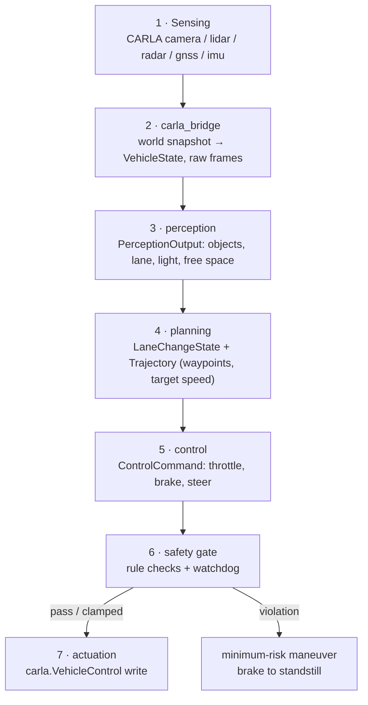

# Architecture

`fsd` is a synchronous, single-rate autonomy stack built around a 20 Hz
sense→plan→act loop. Modules communicate exclusively through the data contracts
in `fsd/core/types.py` — there are no shared mutable structures, no module-level
reach-across imports, and no hidden channels. If data flows between stages, it
flows through a typed dataclass.

## Pipeline stages

### 1–2 · Sensing & bridge (`fsd/carla_bridge/`)

CARLA runs in **synchronous mode** with `fixed_delta_s = 0.05` so the world only
advances when the stack ticks it. The bridge owns:

- **world** — connect, load town, set synchronous mode, seed the RNG.
- **vehicle** — spawn the ego blueprint (`vehicle.tesla.model3` by default),
  read back its kinematic `VehicleState` each tick.
- **sensors** — attach the suite described in `configs/sensors.yaml`, deliver
  frames via callback mailboxes (latest-wins, never blocking).
- **traffic** — spawn background vehicles/pedestrians through the Traffic
  Manager, all under the same `sim.seed` for reproducibility.

The bridge is the only module allowed to `import carla`. Everything downstream
consumes plain dataclasses and stays simulator-agnostic — that is what makes the
unit tests in `tests/` possible without a running server.

### 3 · Perception (`fsd/perception/`)

| Submodule | Output |
| --- | --- |
| `lane_detector` | `LaneInfo` — lateral offset, heading error, curvature |
| `object_detector` | `List[DetectedObject]` — camera + lidar detections |
| `traffic_light` | `LightState` — RED / YELLOW / GREEN / UNKNOWN |
| `fusion` | association of camera/lidar/radar tracks into `DetectedObject`s |
| `occupancy` | free-space grid → `free_space_ahead` (meters of clear path) |
| `segmentation` | semantic masks feeding lane + free-space estimates |

Everything collapses into one `PerceptionOutput` per tick, stamped with the
pipeline timestamp the watchdog later checks.

### 4 · Planning (`fsd/planning/`)

- `route` — waypoint stream toward the destination (`List[Waypoint]`).
- `behavior` — discrete maneuver decision: `LaneChangeState.KEEP / LEFT / RIGHT`
  plus implicit stops for red lights and blocked lanes.
- `trajectory` — smooth `Trajectory` (waypoints + `target_speed` + `horizon_s`)
  that realizes the maneuver.
- `costmap` — occupancy-derived cost layer for collision-free path selection.

### 5 · Control (`fsd/control/`)

Tracks the trajectory: `lateral` (steering) and `longitudinal`
(throttle/brake) controllers backed by `pid`, with `mpc` as a higher-fidelity
option. Output is a single `ControlCommand` in normalized units.

### 6 · Safety gate (`fsd/safety/`)

The final authority. `monitor` re-checks the command against the safety envelope
(TTC, speed cap, accel/brake bounds, free space, watchdog freshness) and either
passes it, clamps it (`DEGRADED`), or replaces it with a safe stop
(`SAFE_STOP` via `fallback`). `diagnostics` records a `SafetyEvent` for every
decision. Details: [SAFETY.md](SAFETY.md).

## Data contracts

All contracts live in `fsd/core/types.py`. Units are SI (meters, m/s, radians,
seconds) and field names carry the unit suffix where ambiguous
(`speed_limit`, `free_space_ahead`, `watchdog_timeout_s`, …).

| Type | Producer → Consumer | Purpose |
| --- | --- | --- |
| `VehicleState` | bridge → all | ego pose, speed, accel, steer, `timestamp` |
| `DetectedObject` | perception → planning/safety | id, class, `Vec3` position/velocity/extent, confidence |
| `LaneInfo` | perception → planning/control | lane offsets, heading error, curvature, `detected` flag |
| `PerceptionOutput` | perception → planning/safety | objects + lane + light + `free_space_ahead` + `timestamp` |
| `Waypoint` / `Trajectory` | planning → control | path points, `target_speed`, `horizon_s`, `empty` |
| `ControlCommand` | control → safety → actuation | `throttle`/`brake` ∈ [0,1], `steer` ∈ [−1,1]; `clamp()` enforces bounds |
| `SafetyEvent` | safety → diagnostics/logs | level, source, message, `timestamp` |
| `DriveMode` / `LightState` / `LaneChangeState` | cross-cutting enums | ENGAGED/DEGRADED/SAFE_STOP/DISENGAGED etc. |

Two invariants the tests enforce: `ControlCommand.clamp()` always lands the
command inside bounds, and `timestamp` fields are always wall-clock seconds —
the watchdog depends on both.

## 20 Hz loop timing budget

Each tick gets **50 ms**. The budget below is the design target; the watchdog
uses `watchdog_timeout_s` (default 0.5 s) as the tripwire for a hard stall.

| Stage | Budget (ms) | Guard |
| --- | ---: | --- |
| Bridge: `world.tick()` + state read | 6 | server round-trip timeout |
| Perception: detect + track | 14 | stale-frame detection per sensor |
| Fusion + occupancy | 4 | confidence floor, grid freshness |
| Planning: behavior + trajectory | 10 | horizon-limited solve |
| Control: PID/MPC step | 5 | iteration cap |
| Safety gate: rule checks | 2 | always-on |
| Actuation write | 1 | fire-and-forget |
| Reserve (jitter, GC, logging) | 8 | — |
| **Total** | **50** | **20 Hz** |

If the loop overruns, later stages still see the same `timestamp` budget — a
persistently late `PerceptionOutput` trips the watchdog rather than silently
driving on old data.

## Fault domains

| Domain | Example failure | Detection | Response |
| --- | --- | --- | --- |
| Sensor | camera/lidar frame stops arriving | per-sensor freshness vs `sensor_tick` | `DEGRADED`; if fused output stalls → `SAFE_STOP` |
| Perception | detector throws / NaNs / empty lane | confidence floor, `LaneInfo.detected`, timestamp age | `DEGRADED` → `SAFE_STOP` |
| Planning | no feasible trajectory, solve timeout | `Trajectory.empty`, wall-clock budget | `SAFE_STOP` |
| Control | saturation, NaN command, steer spike | `clamp()` bounds, `max_steer_rate` | clamped or `SAFE_STOP` |
| Bridge / sim | server hang, missed tick | CARLA client timeout, watchdog | `SAFE_STOP` |
| Platform | clock skew, process starvation | watchdog on stage timestamps | `SAFE_STOP` |

Every fault funnels to the same terminal state: a controlled minimum-risk stop.
There is no "limp home" in v1 — a degraded system that cannot prove its inputs
are fresh is a stopped system.

## Configuration layering

`Config.load(path)` (`fsd/core/config.py`) merges YAML over typed dataclass
defaults:

- `sim`, `safety`, `vehicle` sections map onto `SimConfig`, `SafetyConfig`,
  `VehicleConfig` — keys must match dataclass fields.
- Any other top-level section (e.g. `planning`, `sensors`) is preserved in
  `Config.raw` for the owning module to interpret, keeping `core` free of
  downstream concerns.
