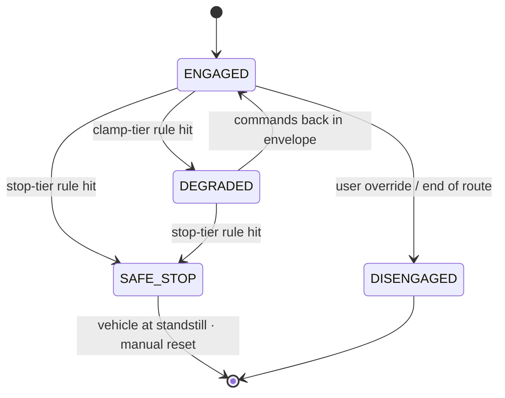

# Safety case

The safety architecture follows one claim:

> **No actuator command reaches the vehicle unless it has passed the safety
> gate, and the gate can always stop the vehicle regardless of what upstream
> modules produce.**

The gate (`fsd/safety/monitor.py`) sits between control and actuation. It is
deliberately small, dependency-free (it needs nothing but `fsd.core`), and
stateful only where state is required (watchdog, steer-rate limiting). Every
gate decision emits a `SafetyEvent` to `diagnostics` so any intervention is
auditable in `logs/fsd.log`.

## Rule set

All thresholds come from the `safety:` section of the config
(`configs/default.yaml` → `SafetyConfig`).

| # | Rule | Threshold (default) | On violation |
| --- | --- | --- | --- |
| R1 | Time-to-collision to lead object | `min_ttc_s = 1.5` | `SAFE_STOP` |
| R2 | Ego speed must not exceed cap while throttle is applied | `max_speed_mps = 16.7` | throttle cut / `DEGRADED` |
| R3 | Longitudinal accel demand | `max_accel_mps2 = 3.0` | clamp to bound |
| R4 | Brake demand ceiling | `max_brake_mps2 = 6.0` | clamp to bound |
| R5 | Clear path ahead | `min_free_space_m = 8.0` | brake / `SAFE_STOP` |
| R6 | Pipeline data freshness | `watchdog_timeout_s = 0.5` | `SAFE_STOP` |
| R7 | Steering rate | `max_steer_rate = 0.4` /s | slew-rate clamp |
| R8 | Command bounds | throttle/brake ∈ [0,1], steer ∈ [−1,1] | `ControlCommand.clamp()` |

Enforcement falls into two tiers:

- **Clamp tier** (R3, R4, R7, R8) — the command is reshaped into the envelope
  and the mode drops to `DEGRADED`. The vehicle keeps driving, the event is
  logged, and recovery is automatic once commands return to the envelope.
- **Stop tier** (R1, R5 hard breach, R6) — the command is replaced by the
  minimum-risk maneuver and the mode latches `SAFE_STOP`.

## Drive-mode state machine

`SAFE_STOP` is intentionally a dead end: the system never re-engages itself.

## Watchdog semantics

Each stage stamps its output (`VehicleState.timestamp`,
`PerceptionOutput.timestamp`) with wall-clock time. On every gate evaluation:

1. The monitor reads the freshest timestamps it depends on.
2. If `now - timestamp > watchdog_timeout_s` for any required input, the
   pipeline is declared **stale** — regardless of how good the stale data
   looked — and the gate issues `SAFE_STOP`.
3. A single late tick does not trip the gate; `watchdog_timeout_s = 0.5` s is
   ten ticks of slack at 20 Hz, enough to absorb jitter but far shorter than
   any plausible "drive blind" window.

The watchdog is the catch-all for whole-class failures the numeric rules cannot
see: a dead camera thread, a hung planner, a frozen CARLA server — they all
manifest as *old timestamps*.

## Minimum-risk maneuver

When the stop tier fires, `fsd/safety/fallback.py` produces the fallback
command:

1. `throttle = 0` immediately.
2. `brake` ramps to demand `max_brake_mps2` (bounded by the same rule table —
   even the fallback obeys the envelope).
3. `steer` holds/returns toward zero so the vehicle stops in-lane rather than
   drifting with the last lateral command.
4. At standstill: `hand_brake = True`, mode remains `SAFE_STOP`.
5. Resume requires an explicit external reset — there is no automatic
   re-engagement path.

## Fault-injection testing

Safety logic is only as good as the tests that try to break it. The harness
drives the monitor with **synthetic states** — no simulator needed:

| Injection | Expected gate response |
| --- | --- |
| Ego 4 m/s over the cap with full throttle request | throttle cut to ~0, `DEGRADED` or stop |
| Lead vehicle with sub-`min_ttc_s` gap | `SAFE_STOP` |
| `free_space_ahead` below `min_free_space_m` | brake / `SAFE_STOP` |
| All timestamps `> watchdog_timeout_s` old | `SAFE_STOP` |
| Out-of-range command (steer ±3, throttle 2) | clamped into bounds |
| NaN/inf fields in command or state | `SAFE_STOP` (fail-closed) |

`tests/test_safety.py` covers the first four cases today; extend the table
whenever a rule is added — **new rule, new injection test, same PR**.

In-sim injections (dropping sensor callbacks, delaying the planning stage,
phantom obstacles via the traffic manager) belong in scenario scripts under
`scripts/` and follow the same expectation: the run may be ruined, the vehicle
may never be.

## Determinism

`sim.seed` (default `7`) is applied to the CARLA world, the Traffic Manager,
and the spawn RNG, so a fault-injection scenario that trips the gate once
trips it identically on replay — the basis for regression-testing the safety
case in CI.
